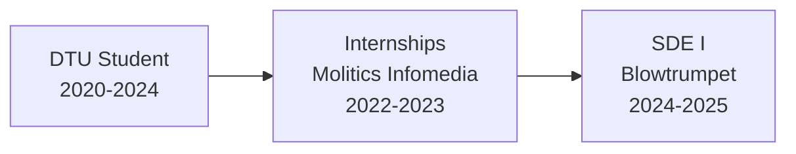

  
# Hi there, I'm Kailash Maurya 👋

## 🚀 About Me

I'm a **Software Engineer** working with expertise in cloud-native networking, observability, and distributed systems. Currently based in Delhi, India, I work on enhancing developer productivity and building scalable network observability solutions.

### 🎯 Quick Facts
- 🛠️ Tech Stack: Kubernetes, Python, JavaScript, Kotlin, TypeScript
- 📚 B.Tech Computer Engineering from Delhi Technological University (8.17/10.0)
- ♟️ Elo enthusiast & open-source contributor

## 💼 Professional Experience

### **Software Development Engineer I** @ Blowtrumpet
*January 2025 - August 2025 | New Delhi, India*

- 🚀 Enhancing developer productivity through CI/CD improvements and test automation
- 🔍 Building network observability solutions with focus on microservices
- 📊 Reduced memory usage by ~15% through performance optimization
- 🎯 Contributing to open-source projects and community engagement

## 🏗️ Featured Projects & Contributions

### 🌟 **Open Source Contributions**
- Active contributor to network observability projects
- Improved documentation and standardized nomenclature for better contributor experience

## 🛠️ Technical Skills

### 🔧 Expertise Areas
- **Cloud Native:** Kubernetes, eBPF, Service Mesh, Container Networking
- **Observability:** Distributed Tracing, Metrics, Logging, Performance Profiling
- **Languages:** Go, Java, Kotlin, Python, TypeScript, C/C++
- **Tools:** GitHub Actions, Prometheus, Azure Monitor, AWS CloudWatch

## 🌐 Career Journey

## 📊 GitHub Stats

## 🎯 Current Focus

- 🔭 Building cloud-native network observability solutions
- 🌱 Exploring eBPF for high-performance networking
- 👯 Contributing to open-source Kubernetes ecosystem
- 💬 Ask me about distributed systems, cloud networking, or performance optimization
- 🎤 Preparing technical talks for cloud-native conferences

## 🎮 Beyond Code

When I'm not optimizing systems and building tools, you'll find me:
- 📚 Reading novels (The Witcher & Harry Potter enthusiast!)
- 👨‍🍳 Experimenting with culinary adventures
- 🤝 Volunteering for community causes
- 🚀 Exploring emerging tech trends
- ✈️ Attending tech conferences and meetups

---

  
### 📫 Let's Connect!

I'm always open to discussing cloud-native technologies, performance optimization, or collaboration opportunities!

*"Building the future of cloud networking, one commit at a time"* 🚀

